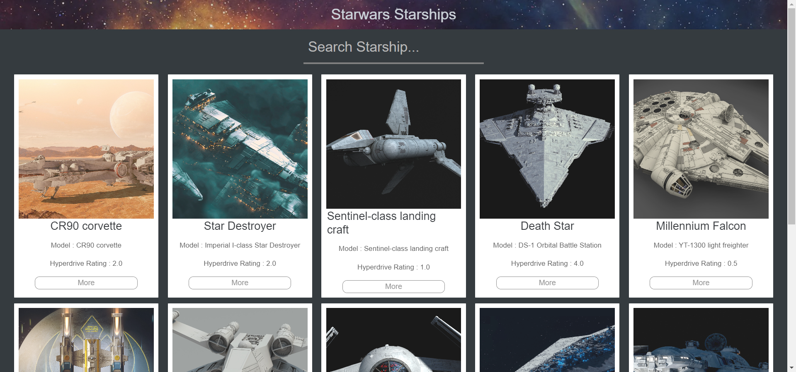
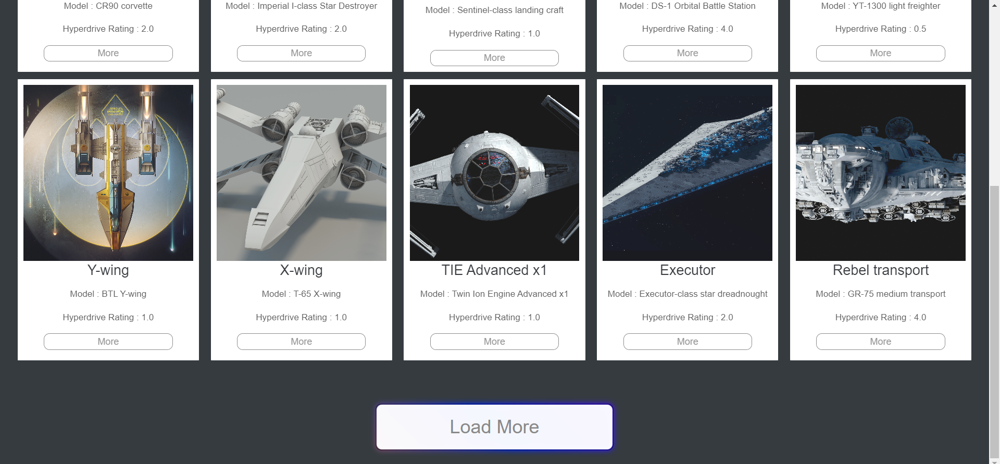
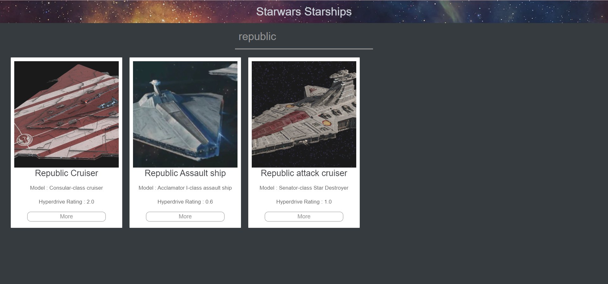
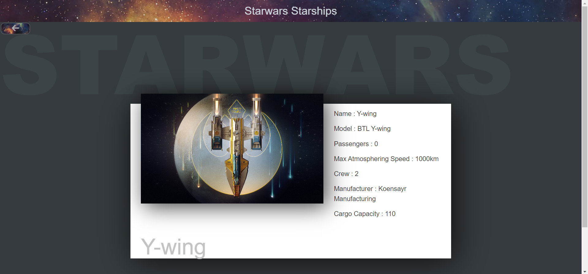

# Starwars Starships Project

In this project i fetch starwars starships data from https://swapi.dev/api/starships .
## About Project
- Users can see listing starships
- Users can load more starships with a load more button
- Users can search among Starships
- Users can click on any item and go to a detail page that includes details of a specific starship 
- Users can go back to home page from detail page
## Technologies
- React.js
- React Router
- Axios

## Setup
- Download or clone the repository
- `npm start` Runs the app in the development mode.\
Open [http://localhost:3000](http://localhost:3000) to view it in your browser.

##Screenshots

